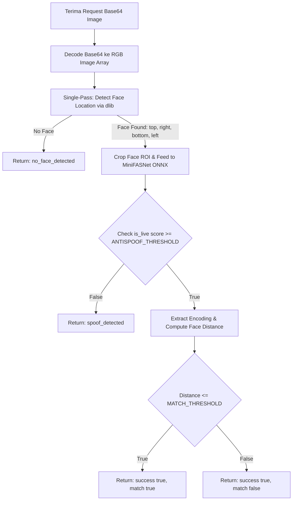

# Implementation Plan — Fase 9: Anti-Spoofing (Liveness) Face Recognition

Menambahkan deteksi anti-spoofing (liveness detection berbasis CNN ringan) ke microservice `apps/face-service` (Python FastAPI) pada endpoint `/verify` untuk mencegah kecurangan presensi menggunakan foto cetak atau foto dari layar HP/laptop.

---

## User Review Required

> [!IMPORTANT]
> - **Desain Deteksi Single-Pass (Efisien & Konsisten)**:
>   - **Deteksi Wajah Dilakukan HANYA 1 KALI**: Proses `face_recognition.face_locations(image_np)` (berbasis dlib) dieksekusi **satu kali saja di awal** handler `/verify`.
>   - **Satu Sumber Bounding Box**: Bounding box `(top, right, bottom, left)` dari deteksi awal digunakan langsung untuk:
>     1. Di-crop dengan margin/padding untuk di-pass ke model anti-spoofing **MiniFASNetV2**.
>     2. Di-pass ke `face_recognition.face_encodings()` untuk ekstraksi vektor 128-d matching.
>   - **Manfaat**: **100% konsisten** (menghindari konflik beda detector) dan **jauh lebih hemat CPU** (menghemat ~100-200ms karena tidak ada redundant face detection).
> - **Spesifikasi Model Anti-Spoofing**:
>   - **Model**: **MiniFASNetV2 (Silent-Face-Anti-Spoofing)** oleh Minivision AI ([GitHub](https://github.com/Minivision-AI/Silent-Face-Anti-Spoofing))
>   - **Lisensi**: **Apache License 2.0** (Permisif & Bebas Komersial).
>   - **Runtime**: **ONNX Runtime (`onnxruntime`)** CPU Engine.
>   - **Threshold**: `ANTISPOOF_THRESHOLD = 0.6` (Configurable via `.env`).
> - **Pesan Error Generik**: Mahasiswa yang gagal karena terdeteksi spoof akan tetap menerima pesan error generik yang sama seperti gagal verifikasi wajah (`"Presensi gagal, silakan coba lagi."`). Detail `spoof_detected` HANYA dicatat pada internal log Laravel (`Log::warning`).

---

## Alur Eksekusi Endpoint `POST /verify` (Single-Pass)

---

## Proposed Changes

### 1. Python Face Microservice (`apps/face-service`)

#### [NEW] [antispoof.py](file:///d:/Projects/BilCode/Student%20Face%20Recog/codebase_new/apps/face-service/app/services/antispoof.py)
- Mengimplementasikan fungsi `check_liveness_from_crop(image_np: np.ndarray, face_location: tuple) -> dict`.
- Menerima image array dan bounding box lokasi wajah hasil deteksi `dlib/face_recognition`.
- Melakukan cropping wajah dengan rasio scaling/padding standar (1.5x - 2.7x), meresize ke `80x80` / `128x128`, menormalkan tensor input, dan menjalankan inferensi via `onnxruntime`.
- Mengembalikan: `{"is_live": bool, "score": float}`.

#### [NEW] [models/MiniFASNetV2.onnx](file:///d:/Projects/BilCode/Student%20Face%20Recog/codebase_new/apps/face-service/app/models/MiniFASNetV2.onnx)
- File model ONNX MiniFASNetV2.

#### [MODIFY] [requirements.txt](file:///d:/Projects/BilCode/Student%20Face%20Recog/codebase_new/apps/face-service/requirements.txt)
- Menambahkan dependency `onnxruntime>=1.17.0` dan `opencv-python-headless>=4.9.0`.

#### [MODIFY] [recognition.py](file:///d:/Projects/BilCode/Student%20Face%20Recog/codebase_new/apps/face-service/app/services/recognition.py)
- Mengintegrasikan alur Single-Pass di `verify_face()`:
  1. Deteksi `face_locations` (dlib) 1x.
  2. Panggil `check_liveness_from_crop(image_np, face_locations[0])`.
  3. Jika `is_live` false -> return `{"success": False, "error": "spoof_detected"}`.
  4. Lanjut hitung `face_encodings(image_np, face_locations)` & distance match.

#### [MODIFY] [.env.example](file:///d:/Projects/BilCode/Student%20Face%20Recog/codebase_new/apps/face-service/.env.example)
- Menambahkan `ANTISPOOF_THRESHOLD=0.6`.

---

### 2. Laravel API Service (`apps/api`)

#### [MODIFY] [FaceRecognitionService.php](file:///d:/Projects/BilCode/Student%20Face%20Recog/codebase_new/apps/api/app/Services/FaceRecognitionService.php)
- Memastikan response error `spoof_detected` ditangkap dan menghasilkan exception dengan pesan generik `"Presensi gagal, silakan coba lagi."`.

#### [MODIFY] [AttendanceService.php](file:///d:/Projects/BilCode/Student%20Face%20Recog/codebase_new/apps/api/app/Services/AttendanceService.php)
- Menambahkan `Log::warning("Anti-spoofing trigger: Terdeteksi indikasi foto/layar HP", ['user_id' => $student->id, 'session_id' => $sessionId])`.

---

## Verification Plan

### Automated / Script Testing
1. **Single-Pass Detection Benchmark**:
   - Memverifikasi `face_locations` hanya dipanggil 1 kali per request `/verify`.
   - Mencatat waktu eksekusi latensi total per request (target < 300ms di CPU).
2. **Liveness & Spoofing Test**:
   - Uji foto wajah asli vs foto layar/print out.

### Manual Verification
1. **Check-in Presensi via Frontend / API**:
   - Check-in wajah asli -> Berhasil.
   - Check-in foto layar HP -> Gagal generik.
2. **Log Verification**:
   - Memeriksa `storage/logs/laravel.log` tercatat `spoof_detected`.
